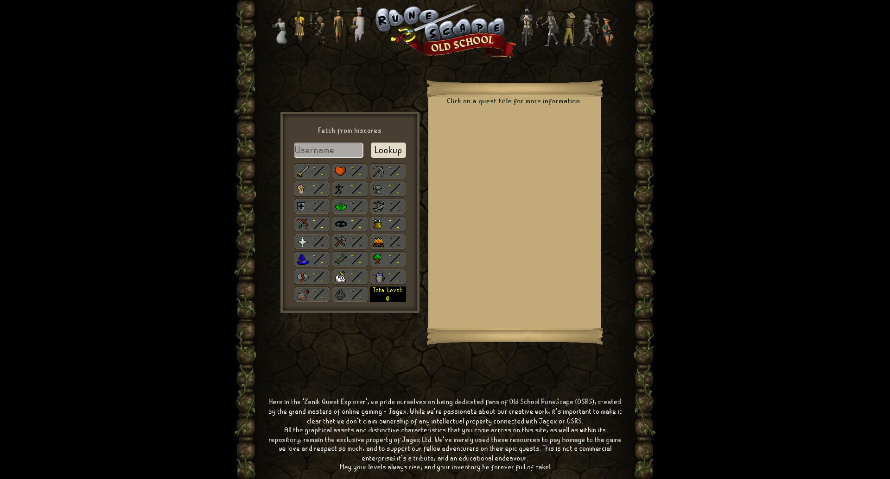

# Zanik Quest Explorer

Welcome to Zanik Quest Explorer, a fan-made tool designed to enhance your Old School RuneScape (OSRS) questing experience. Gain access to exhaustive quest lists, detailed quest information, and player stats assessments at your fingertips.



## Features

- **Quest List**: Get a comprehensive, organized list of quests at your disposal.
- **Quest Details**: Find detailed information on each quest including prerequisites and requirements.
- **Player Stats**: Check out a player's skill levels to understand whether they qualify for a quest.
- **Accessibility**: We prioritize accessibility for an inclusive user experience.

## Project Structure

Here's an overview of the main folders and their purpose:

```bash
zanik-quest-explorer
│   .eslintrc.json
│   .gitignore
│   LICENSE.md
│   next-env.d.ts
│   next.config.js
│   package-lock.json
│   package.json
│   README.md
│   tsconfig.json
│
├───public
│
└───src
    ├───components
    │   ├───Player
    │   │       PlayerStats.module.css
    │   │       PlayerStats.tsx
    │   │
    │   ├───Quest
    │   │       QuestDetails.module.css
    │   │       QuestDetails.tsx
    │   │       QuestItem.module.css
    │   │       QuestItem.tsx
    │   │       QuestList.module.css
    │   │       QuestList.tsx
    │   │
    │   └───shared
    │           Banner.module.css
    │           Banner.tsx
    │           Button.module.css
    │           Button.tsx
    │           Container.module.css
    │           Container.tsx
    │           Footer.module.css
    │           Footer.tsx
    │           Loading.module.css
    │           Loading.tsx
    │           NoPlayerFound.module.css
    │           NoPlayerFound.tsx
    │
    ├───pages
    │   │   index.tsx
    │   │   _app.tsx
    │   │   _document.tsx
    │   │
    │   └───api
    │           hiscores.ts
    │
    ├───styles
    │       globals.css
    │       Home.module.css
    │       
    ├───types
    │       player.interface.ts
    │       quests.interface.ts
    │
    └───utils
            fetchQuests.ts
```

- **/public**: This directory contains static resources like images.
- **/src/components**: This directory contains all the React components, organized by their concern.
- **/src/pages**: This directory contains all the Next.js pages and their corresponding API routes.
- **/src/styles**: This directory contains global CSS styles.
- **/src/types**: This directory contains TypeScript type definitions.
- **/src/utils**: This directory contains utility functions used across the project.

## Getting Started

1. Clone the repository:
   ```
   git clone https://github.com/lsprr/zanik-quest-explorer.git
   ```
2. Navigate to the project directory:
   ```
   cd zanik-quest-explorer
   ```
3. Install the necessary dependencies:
   ```
   npm install
   ```
4. Run the development server:
   ```
   npm run dev
   ```

## Scripts

- **dev**: Runs the application in development mode.
- **build**: Builds the application for production.
- **start**: Starts the application in production mode.
- **lint**: Lints the application code.

## Dependencies

- **Next.js**: A JavaScript framework for building server-rendered or statically exported React apps.
- **React**: A JavaScript library for building user interfaces.
- **TypeScript**: A typed superset of JavaScript that compiles to plain JavaScript.
- **oldschooljs**: A library that provides detailed information about Old School RuneScape game.

## Acknowledgments

The project heavily relies on the [oldschooljs](https://github.com/oldschoolgg/oldschooljs) library for retrieving Old School RuneScape data. Big thanks to the library's contributors!

## Disclaimer

Zanik Quest Explorer is a fan-made project and claims no ownership of any intellectual property associated with Jagex or Old School RuneScape. All assets found on the site and the repository are the sole property of Jagex and are used solely for non-commercial and educational purposes.

## Contribute

Pull requests are welcome. For major changes, please open an issue first to discuss what you would like to change.

## License

This project is licensed under the MIT License. See the `LICENSE.md` file for more details.

## Author

This project is created by [Luis Parra](https://github.com/lsprr).

## Links

- [GitHub](https://github.com/lsprr/zanik-quest-explorer)
- [Live Site](https://zanik-quest-explorer.vercel.app)